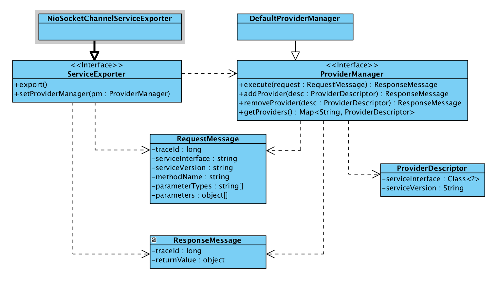

#自己动手实现RPC框架(1)－简单发布服务
## 索引
__replacing__

>代码库<br/>
>[https://github.com/destinyshine/storks-rpc.git](https://github.com/destinyshine/storks-rpc.git)

## 什么是RPC
rpc是远程过程调用，在本地代码中使用模拟调用本地方法的形式调用远程的服务过程。
### RPC的优点
* 对于服务器端开发人员而言，容易设计、开发。
* 对于消费者而言，调用非常简单。
* 便于做集中的监控。
* 基于socket的二进制RPC协议，建立连接延迟低、网络传输效率高。
* 支持有状态的长连接，可进行双向通信，实时性好。
* 在各个企业的使用较为成熟，许多企业都有自己的RPC实践，并已广泛应用在生产环节。
### RPC 的缺点
* 紧耦合
	* API一旦发布，就难以再做改动。
	* 客户端必须使用特定的框架，而且还需引入API包。
* 没有统一的设计风格
	* 增加了客户端开发人员的学习成本
	* 难以实现通用的客户端库,每个RPC框架都有各自的协议。
	* 通常以动词的形式设计API，一个功能就增加一个API，设计的时候很少考虑领域模型。
* 掩盖了网络的复杂性
	* 开发人员很容易混淆远程调用与本地调用。  
		实际上网络调用与本地调用是完全不同的，RPC的调用方式，让使用者很难意识到是在进行网络调用，忽略了针对网络复杂性的处理。
	* 会损害用户（客户端）可感知的性能

尽管RPC有许多的优点和缺点，但是在互联网企业中应用非常广泛，具有很高的学习价值。并且对网络、IO、线程等知识领域都有涉及，是较好的学习路径。因此我们通过自己实现一个RPC框架来学习和强化相应的知识，并且可以更了解RPC底层的设计思路，在工作中实现应用代码的时候更加心中有数。
### 典型RPC的要点
* 服务发布
	* 序列化协议
	* 服务响应
		* 线程模型
* 透明调用
	* 动态代理
	* 服务发现
		* 负载均衡

## 第一步,单一直连

### 实现目标
RPC最核心的部分是服务发布和服务调用，服务动态发现和负载均衡都是更为高级的特性。在第一步，我们先实现一个仅支持单一直连和的RPC框架。

* 直连，所谓直连的意思，就是客户端必须预先配置好服务端的信息（包括服务地址和服务协议）。所以在这一步，不需要服务注册和服务发现，也就不需要服务注册表。
* 单一，单一是指客户端预先配置的provider只有一个，如果客户端预先配置的provider list含有两个及以上元素，尽管不使用服务发现，仍然会存在负载均衡的问题，所以这一步我们只支持配置一个provider。

### 发布服务
发布服务是指服务端开始提供服务并能响应请求，和服务注册不是一回事情。

在这一步，我们要编写服务端代码。服务端代码有以下要素：

* 网络IO框架，网络框架我们采用netty，并使用nio模式，netty具备良好的线程模型和丰富的框架功能。基于netty可以事半功倍。
* 序列化协议，序列化协议使用protestuff，这是参考了google protebuf的纯java序列化框架，兼容protobuf协议。


### 实现细节
#### 1. 消息传输
客户端的请求称为RequestMessage，服务端响应称为ResponseMessage，请求和响应在网络中传递，数据包会被拆分或合并，也就是我们常说的拆包和粘包。**所以数据要能够根据一定规则切分成一帧一帧，也就是正确还原为消息。**

常用的消息帧处理方式有：

* 定长消息，每个消息体的长度固定并事先知晓。消息收发方都按约定的长度接收、发送消息。
* 长度前置变长消息，每个消息的固定头几位表示消息的长度(size)，后面接着消息内容。通常用4位或8位前缀表示内容长度，前缀解析位整形数字，该数字就是消息内容大小。如通常的RPC协议，消息队列，都是使用这种方式，这种方式的使用非常广泛。
* 字符分割，固定的一个或多个字符代表一个消息的结束。如http协议使用连续的两个换行符表示消息结束。

我们采用长度前置的变长消息来处理信息帧，对应netty的实现就是LengthFieldBasedFrameDecoder。

#### 2.io模式&响应方式
当然是使用nio了。基于netty的nio编程也非常高效。

在这个阶段，我们不区分业务线程和IO线程，直接用netty IO线程调用provider的业务代码。再以后的完善过程加上业务线程的区分。

### 类定义
类图如下：



### 代码实现

#### ServiceExporter
ServiceExporter将服务发布到网络环境，负责响应&解析Request、编码&发送Response。总而言之就是负责网络边界处理，不负责Request的执行。

具体查找Provider、执行Request、调用业务代码、产生Response的功能被委托给ProviderManager。

下面用Netty NIO实现一个ServiceExporter。

```java
package io.destinyshine.storks.provider; 
/**
 *
 * 基于Netty NIO实现的服务发布。
 * <p>
 *     将服务发布到网络环境，可以供消费端调用，处理消费端请求并返回响应消息。
 * </p>
 *
 * @author liujianyu
 * @date 2017/08/10
 */

import ...

@Slf4j
public class NioSocketChannelServiceExporter implements ServiceExporter {

    private final int servicePort;

    private Channel channel;
    private InetSocketAddress localAddress;
    private ProviderManager providerManager;
    
    /**
     * 使用一个本地服务端口构造exporter，将通过指定端口提供服务。
     * <p>
     *     如果localPort为0，代表使用随机端口，在服务启动后通过{@link #getServicePort()}获取实际端口。
     * </p>
     * @param localPort 服务端口，为0可使用随机端口。
     * @see #getServicePort() 
     */
    public NioSocketChannelServiceExporter(int localPort) {
        this.servicePort = localPort;
    }

    @Override
    public void export() throws InterruptedException {
        Objects.requireNonNull(providerManager, "please set providerManager non null before export services.");

        ServerBootstrap bootstrap = new ServerBootstrap();
        EventLoopGroup group = new NioEventLoopGroup();
        try {
            bootstrap.group(group);
            bootstrap.channel(NioServerSocketChannel.class);
            bootstrap.localAddress(new InetSocketAddress(servicePort));
            bootstrap.childHandler(new ChannelInitializer<SocketChannel>() {
                @Override
                protected void initChannel(SocketChannel ch) throws Exception {
                    ch.pipeline()
                        .addLast(Protocol.newFrameDecoder())
                        .addLast(new ProtostuffDecoder<>(RequestMessage.class, RequestMessage::new))
                        .addLast(new ProtostuffEncoder<>(ResponseMessage.class))
                        .addLast(new RequestMessageHandler(providerManager));
                }
            });
            ChannelFuture channelFuture = bootstrap.bind().sync();
            this.channel = channelFuture.channel();
            this.localAddress = (InetSocketAddress)this.channel.localAddress();
            exportCompleted(providerManager);
        } catch (Exception e) {
            e.printStackTrace();
        } finally {
        }
    }

    protected void exportCompleted(ProviderManager providerManager) {
        //export完成后置处理，未来可用于注册服务到注册中心等。
    }

    private ServiceInstance toServiceInstance(ProviderDescriptor desc) {
        StorksApplication application = providerManager.getApplication();
        ServiceInstance serviceInstance = ServiceInstance.builder()
            .appName(application.getAppName())
            .protocol("storks")
            .host(application.getLocalHost())
            .port(getServicePort())
            .serviceInterface(desc.getServiceInterface().getName())
            .serviceVersion(desc.getServiceVersion())
            .build();
        return serviceInstance;
    }

    public int getServicePort() {
        return this.localAddress.getPort();
    }

    @Override
    public void setProviderManager(ProviderManager providerManager) {
        this.providerManager = providerManager;
    }
}
```

#### ProviderManager
ServiceExporter只是负责搭建网络边界的沟通桥梁，而具体的provider业务代码执行由ProviderManager负责。

ServiceExporter负责将网络请求还原为request，以及将response发送到网络；而providerManager负责查找本地Provider和执行request。

```java
package io.destinyshine.storks.provider;

import ...

/**
 * 管理所有的Provider，Provider以{@link ProviderDescriptor}类来表示，所有的Provider需要注册到ProviderManager中。
 * <p>
 *     ServiceExporter只是负责搭建网络边界的沟通桥梁，而具体的provider业务代码执行由ProviderManager负责。
 *     ServiceExporter负责将网络请求还原为request，以及将response发送到网络；而providerManager负责查找本地Provider和执行request。
 * <p/>
 * <p>
 *     根据以上设计，如果本地ProviderTable没有指定的Provider，则这个NoProviderDefinedException异常由ProviderManager抛出，而不是ServiceExporter。
 *
 * </p>
 * @author liujianyu
 */
 @Slf4j
public class DefaultProviderManager implements ProviderManager {

    private Map<String, ProviderDescriptor> localProviderTable = new ConcurrentHashMap<>();

    private StorksApplication application;

    private boolean working = false;

    private List<ServiceProviderListener> serviceProviderListeners = new ArrayList<>();

    @Override
    public <T> ProviderDescriptor<T> findProvider(String serviceInterface, String version) {
        String key = serviceInterface + ":" + version;
        ProviderDescriptor<T> providerDescriptor = localProviderTable.get(key);
        if (providerDescriptor == null) {
            throw new NoProviderDefinedException(
                String.format(
                    "no provider of interface %s defined.",
                    serviceInterface
                )
            );
        }
        return providerDescriptor;
    }

    @Override
    public ResponseMessage execute(RequestMessage request) {
        ProviderDescriptor<?> desc = this.findProvider(request.getServiceInterface(), request.getServiceVersion());
        Object provider = desc.getProvider();
        Class<?>[] parameterClasses = new Class<?>[request.getParameterTypes().length];
        for (int i = 0; i < request.getParameterTypes().length; i++) {
            try {
                parameterClasses[i] = Class.forName(request.getParameterTypes()[i]);
            } catch (ClassNotFoundException e) {
                e.printStackTrace();
            }
        }
        try {
            Method method = provider.getClass().getMethod(request.getMethodName(), parameterClasses);
            Object returnValue = method.invoke(provider, request.getParameters());
            ResponseMessage responseMessage = new ResponseMessage();
            responseMessage.setReturnValue(returnValue);
            responseMessage.setTraceId(request.getTraceId());
            return responseMessage;
        } catch (NoSuchMethodException e) {
            logger.error(e.getMessage(), e);
        } catch (InvocationTargetException e) {
            logger.error(e.getMessage(), e);
        } catch (IllegalAccessException e) {
            logger.error(e.getMessage(), e);
        }

        return null;
    }

    @Override
    public void addProvider(ProviderDescriptor desc) {
        String serviceKey = Protocol.serviceKey(desc);
        localProviderTable.put(serviceKey, desc);
    }

    @Override
    public void removeProvider(ProviderDescriptor desc) {
        String serviceKey = Protocol.serviceKey(desc);
        localProviderTable.remove(serviceKey);
    }

    @Override
    public StorksApplication getApplication() {
        return application;
    }

    public void setApplication(StorksApplication application) {
        this.application = application;
    }

    @Override
    public Map<String, ProviderDescriptor> getProviders() {
        return localProviderTable;
    }
}

```

#### 启动服务端
在这里我们没有和spring集成，更没有编写spring boot starter。我们先用最原始的方式通过执行main方法和原始API来启动服务。

代码实现：

```java
public static void main(String[] args) throws Exception {

    logger.info("--server main--");

    StorksApplication app = new StorksApplication("testProvider");

    ProviderDescriptor desc = new ProviderDescriptor(HelloService.class, "1.0.0", new HelloServiceImpl());

    NioSocketChannelServiceExporter exporter = new NioSocketChannelServiceExporter(0);

    DefaultProviderManager providerManager = new DefaultProviderManager();
    providerManager.setApplication(app);
    //add provider
    providerManager.addProvider(desc);

    exporter.setProviderManager(providerManager);
    exporter.export();

    logger.info("exporter started.");

}
```

## 后续
到目前只实现了简单的服务发布，还没有客户端调用的实现，将在后面实现。


 