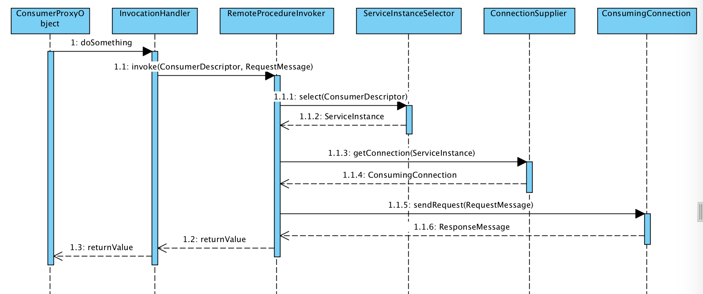

#自己动手实现RPC框架(3)－服务注册&服务发现
## 索引

* [自己动手实现RPC框架(1)－发布服务](https://www.atatech.org/articles/89606)
* [自己动手实现RPC框架(2)－服务调用](https://www.atatech.org/articles/89904)
* 自己动手实现RPC框架(3)－服务注册&服务发现 `待续`

## 目的
在这一步，我们要实现服务注册与发现。

## 注册中心
为了实现服务注册与发现，我们需要一个支持服务注册的组件。

### 注册中心选型
通常来讲，如果我们要构建一个服务注册中心，很多人的第一反应是可以用zookeeper来实现，然而实际上zookeeper并不是一个合适的服务注册中心。

* zookeeper 较为底层，只是一个node列表维护的程序，不具备服务注册&服务发现的常用语意，需要自己去实现。
* 在CAP原理的抉择中，zookeeper牺牲了可用性，用以保证一致性和分区容错性。zookeeper本身设计用来做分布式应用的协调者，这么设计是可以理解的。但对于服务注册，可用性是优先级最高的。

*注：其实zookeeper本身的可用性也是非常高的。只是在zookeeper的设计思想中可用性的优先级较一致性和分区容错性低，主要是在极端情况下的抉择。*

除了zookeeper，还有很多专门的服务注册管理软件，专门针对服务注册和发现而设计，比较符合我们的场景，较为常见、使用广泛的有eureka何consul：

* netflix eureka，微服务设计的引领者netfix推出的服务注册&发现组件，知名度较高。spring cloud也对eureka做了封装和支持，使用非常方便，与同样来自netflix公司的客户端负载均衡组件ribbon可以完美配合。
* consul，同样是一个专门的服务注册&发现组件，consul的api更为友好，原生的API是restful api，还有各种编程语言封装的客户端。

<table>
    <thead>
        <tr>
            <th width="26%">Feature</th>
            <th width="21%">Consul</th>
            <th width="17%">zookeeper</th>
            <th width="18%">etcd</th>
            <th width="18%">euerka</th></tr>
    </thead>
    <tbody>
        <tr>
            <td>服务健康检查</td>
            <td>服务状态，内存，硬盘等</td>
            <td>(弱)长连接，keepalive</td>
            <td>连接心跳</td>
            <td>可配支持</td></tr>
        <tr>
            <td>多数据中心</td>
            <td>支持</td>
            <td>—</td>
            <td>—</td>
            <td>—</td></tr>
        <tr>
            <td>kv存储服务</td>
            <td>支持</td>
            <td>支持</td>
            <td>支持</td>
            <td>—</td></tr>
        <tr>
            <td>一致性</td>
            <td>raft</td>
            <td>paxos</td>
            <td>raft</td>
            <td>—</td></tr>
        <tr>
            <td>cap</td>
            <td>ca</td>
            <td>cp</td>
            <td>cp</td>
            <td>ap</td></tr>
        <tr>
            <td>使用接口(多语言能力)</td>
            <td>支持http和dns</td>
            <td>客户端</td>
            <td>http/grpc</td>
            <td>http（sidecar）</td></tr>
        <tr>
            <td>watch支持</td>
            <td>全量/支持long polling</td>
            <td>支持</td>
            <td>支持 long polling</td>
            <td>支持 long polling/大部分增量</td></tr>
        <tr>
            <td>自身监控</td>
            <td>metrics</td>
            <td>—</td>
            <td>metrics</td>
            <td>metrics</td></tr>
        <tr>
            <td>安全</td>
            <td>acl /https</td>
            <td>acl</td>
            <td>https支持（弱）</td>
            <td>—</td></tr>
        <tr>
            <td>spring cloud集成</td>
            <td>已支持</td>
            <td>已支持</td>
            <td>已支持</td>
            <td>已支持</td></tr>
    </tbody>
</table>

还有一个细节，eureka只支持server级别的注册，不支持service级别的注册。而且consul支持resetful客户端，也就是只要支持http协议即可，我们直接使用restful接口，不使用其他第三方客户端，可以少依赖很多jar。

因此，最终我们选择consul作为服务注册表，但这个不是强耦合的，我们定义好核心接口后，可以自由实现其他的服务注册表。

## 设计

回顾前两个章节，其实核心的接口已经定义好了。我们只需要替换那两个接口的实现方式即可。

### consul客户端
consul的java客户端有consul-api和consul-client两种，本质上都是对restful http api的封装。

在这里我们会再抽象抽象出一层本系统ConsulClient，底层再调用具体的Consul客户端。可以自由切换各种Consul客户端。

由于Consul原生的API就是restful http client，所以我们没必要依赖第三方的客户端，自己实现一个restful客户端即可。由于现在Spring已经是java ee界的事实标准，Spring提供的RestTemplate用来实现Rest客户端非常友好，因此我们自己用RestTemplate实现一个consul 客户端。不用依赖其他不必要的类库。

### 客户端实现
回顾上一章客户端的时序图： 

注意ServiceInstanceSelector接口，这个接口的作用是查找一个服务实例（ServiceInstance），在上一章我们实现的是一个简单的直连查找（Direct ServiceInstanceSelector）。要实现客户端的服务发现，我们只需要替换这个接口的实现类即可。改成从服务注册中心查找服务实例。

### 服务端实现
服务端的ProviderManager需要增加一个Listener的功能，当有新的Provider被发布的时候，会通知所有注册的Listener，我们通过实现Listener接口来把服务信息写入到注册表。

#### 组件和领域层次的对应关系
同一个概念在不同的层次深度，有不同的表述形式，对于一个服务，在应用程序的不同领域层次里有不同的类描述，其关系如下：

#### 重要类描述

### 代码实现

#### RemoteProcedureInvoker

 